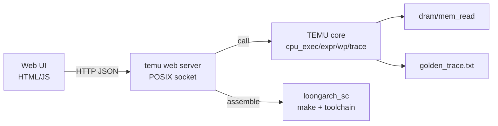

# 技术设计: TEMU Web 图形界面（仿 Venus）

## 技术方案

### 核心技术
- **HTTP 服务:** 纯 C（POSIX socket）实现最小 HTTP/1.1（GET/POST），JSON 手写序列化
- **前端 UI:** 静态 `HTML/CSS/JS`（无构建链），Fetch 调用 JSON API
- **进程内集成:** Web 服务与 TEMU 同进程运行，复用现有 `cpu_exec`/`expr`/`watchpoint`/`trace`
- **重汇编:** 服务端调用 `make USER_PROGRAM=<name>`（在 `TEMU/loongarch_sc`）生成并重载 `inst.bin/data.bin`

### 实现要点
- **状态快照 API:** 提供 `GET /api/state` 返回 `pc`、`gpr[32]`、`temu_state`
- **控制 API:**
  - `POST /api/run`（持续运行）
  - `POST /api/step`（步进 N）
  - `POST /api/stop`（停止）
  - `POST /api/reset`（重置并重载）
- **调试 API:**
  - `POST /api/expr`（求值）
  - `POST /api/mem`（读内存字）
  - `POST /api/wp`（增/删/列出监视点）
- **文件/编辑器:**
  - `POST /api/upload`（上传 `inst.bin/data.bin`）
  - `POST /api/assemble`（提交编辑器文本，写入 `TEMU/loongarch_sc/src/<name>.S` 并调用 make）
- **trace:**
  - `GET /api/trace` 下载 `temu/trace/golden_trace.txt`

## 架构设计

## 架构决策 ADR

### ADR-001: 采用最小依赖 Web UI
**上下文:** 需要“仿 Venus”式 GUI，但环境与依赖不确定。
**决策:** 使用纯 C HTTP 服务 + 静态 HTML/JS（无构建链）。
**理由:** 跨平台、依赖少、便于教学与提交。
**替代方案:** Electron/现代前端框架 → 拒绝原因: 构建链复杂、依赖重、环境差异大。
**影响:** HTTP 实现需严格控制功能边界（仅本地），并注意并发与安全限制。

## API设计

### GET /api/state
- **响应:** `{ "pc": "80000000", "gpr": ["00000000", ...], "temu_state": "STOP" }`

### POST /api/step
- **请求:** `{ "n": 1 }`
- **响应:** 同 `/api/state`（执行后状态）

### POST /api/expr
- **请求:** `{ "expr": "$a0+4" }`
- **响应:** `{ "success": true, "value": "00000010" }`

## 数据模型
不新增持久化数据；trace 文件为文本输出（已存在）。

## 安全与性能
- **安全:** 仅监听 `127.0.0.1`；限制上传大小；拒绝目录穿越；重汇编命令固定白名单参数
- **性能:** 单线程事件循环（轮询/短连接），满足教学规模

## 测试与部署
- **测试:** 单元级构建检查（`gcc -fsyntax-only`），接口手工验证（本地浏览器）
- **部署:** `make run` 启动后打印访问地址（如 `http://127.0.0.1:8080`）

