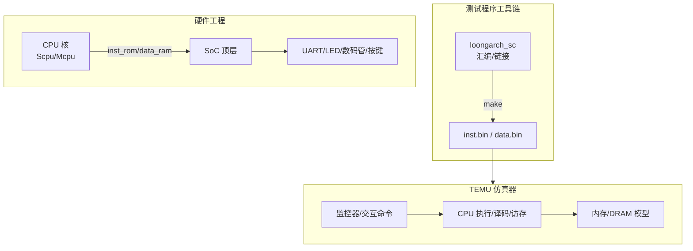
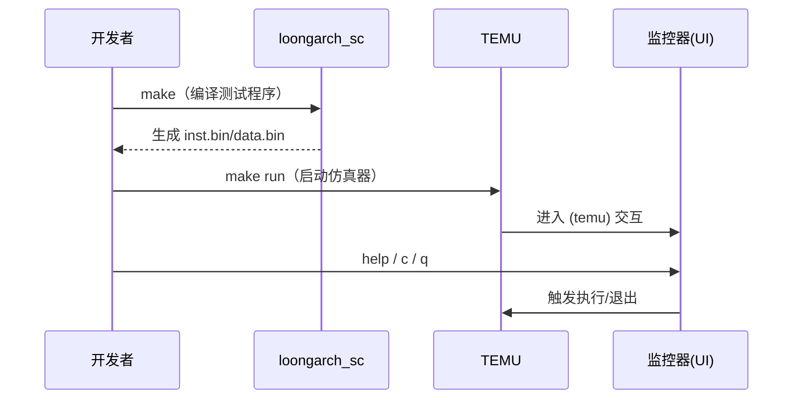

# 架构设计

## 总体架构

## 技术栈
- **HDL:** Verilog / SystemVerilog（Vivado 工程）
- **软件:** C（依赖 `readline`），汇编与链接脚本（生成 ROM/RAM 镜像）

## 核心流程

## 重大架构决策
完整的 ADR 存储在各变更的 how.md 中，本章节提供索引。

| adr_id | title | date | status | affected_modules | details |
|--------|-------|------|--------|------------------|---------|

